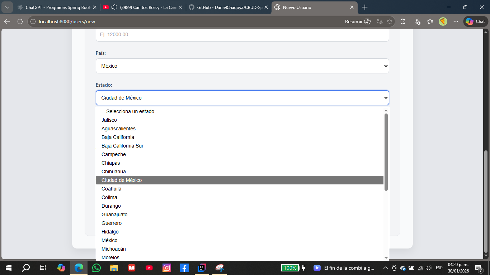
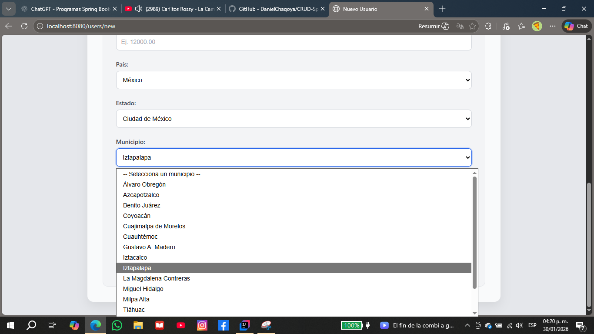

# 💻 Sistema de Gestión de Usuarios

Aplicación web desarrollada con **Spring Boot** para la gestión de usuarios, que permite crear, editar, listar y eliminar registros, integrando formularios dinámicos y una interfaz limpia orientada a sistemas administrativos reales.

Este proyecto representa la **versión 2** del sistema, incorporando mejoras visuales y funcionalidades dinámicas en el frontend.

---

## 🚀 Características

- CRUD completo de usuarios
- Formularios dinámicos con carga dependiente:
    - País → Estado → Municipio
- Interfaz tipo *admin panel* con diseño limpio en tonos grises
- Validaciones de datos en backend
- Manejo centralizado de errores
- Separación clara de capas:
    - Controller
    - Service
    - Repository
- Uso de Thymeleaf para renderizado del frontend

---

## 🛠️ Tecnologías utilizadas

- Java 17
- Spring Boot
- Spring Data JPA
- Thymeleaf
- HTML5
- CSS3
- JavaScript (Fetch API)
- MySQL
- Maven

---

## 📂 Estructura del proyecto

```
src/
└── main/
    ├── java/
    │   └── com/
    │       └── userapp/
    │           ├── controller/
    │           ├── dto/
    │           │   ├── request/
    │           │   └── response/
    │           ├── mapper/
    │           ├── model/
    │           ├── repository/
    │           ├── service/
    │           └── UserAppApplication.java
    └── resources/
        ├── static/
        │   ├── assets/
        │   ├── scripts.js
        │   └── styles.css
        ├── templates/
        │   ├── users.html
        │   └── user-form.html
        └── application.properties
database/
└── queries.sql
pom.xml
README.md
.gitignore


```
---

---

## ⚙️ Configuración y ejecución

1. Clona el repositorio:
```bash

git clone https://github.com/DanielChagoya/CRUD-Spring-Boot

2. Configura la base de datos en application.properties
3. Ejecuta el proyecto: mvn spring-boot:run
4. http://localhost:8080/users


```
---

## 🧪 Base de datos

La carpeta database/ contiene scripts SQL de apoyo para consultas y pruebas durante el desarrollo.

---

## 📸 Capturas de pantalla

### Vista principal




---

## 📌 Notas

- Proyecto desarrollado con enfoque en buenas prácticas y escalabilidad.  

- Ideal como proyecto de portafolio para perfil Java Backend Junior.

---

## 👨‍💻 Autor

**Daniel Chagoya**  
Ingeniero en Sistemas Computacionales